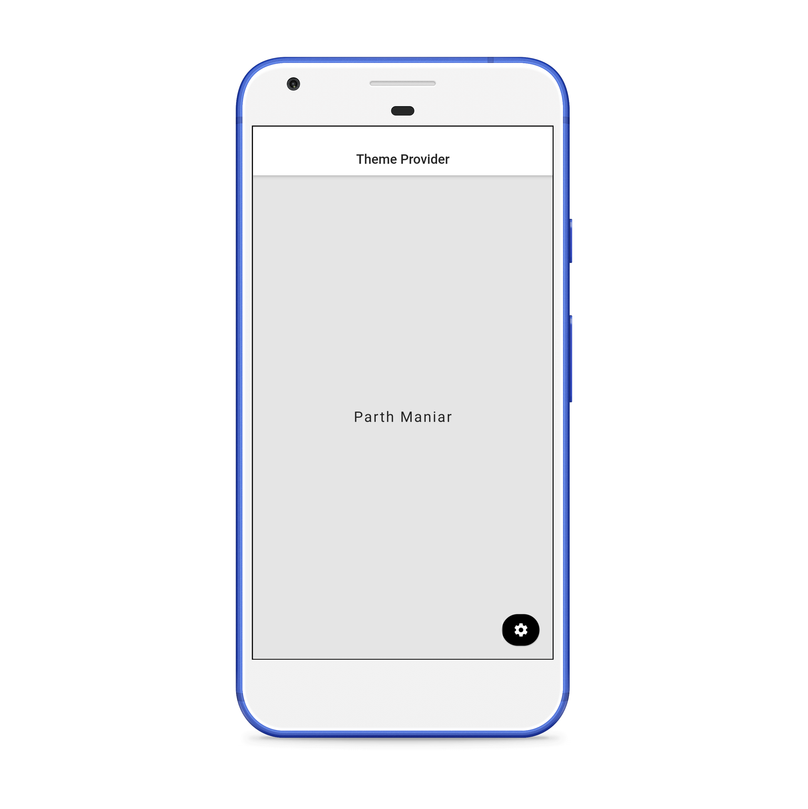
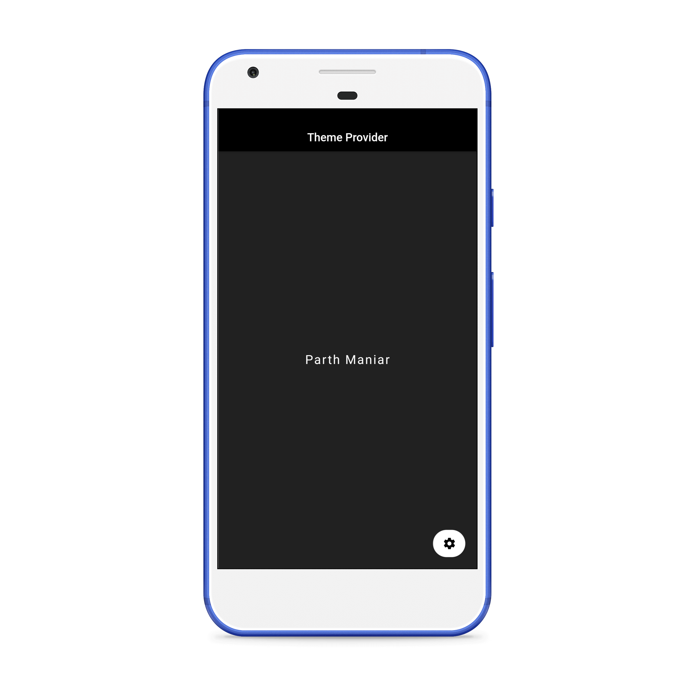
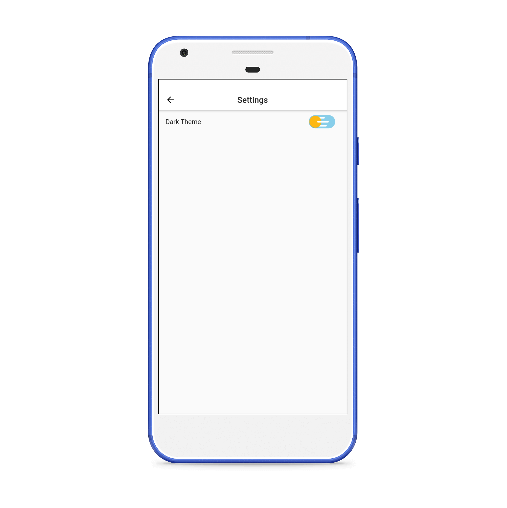

# :sparkles: Theme Provider in Flutter

Demo Application in Flutter using Provider.

# :art: Screenshots

Light Mode                 | Dark Mode      | Settings
:-------------------------:|:----------------------:|:----------------------:
  |  | 

# :green_heart: Download
You can [download](https://github.com/officialpm/Flutter-Theme-Provider/releases/download/v1.0.0/app-arm64-v8a-release.apk) the application for android and try it yourself.

# :bug: Bugs or Requests

If you encounter any problems feel free to open an [issue](https://github.com/officialpm/Flutter-Theme-Provider/issues/new). Pull requests are also welcome.

------------
  `Parth Maniar`

[][1][][2]

[1]: https://www.github.com/officialpm
[2]: https://www.linkedin.com/in/parthdmaniar